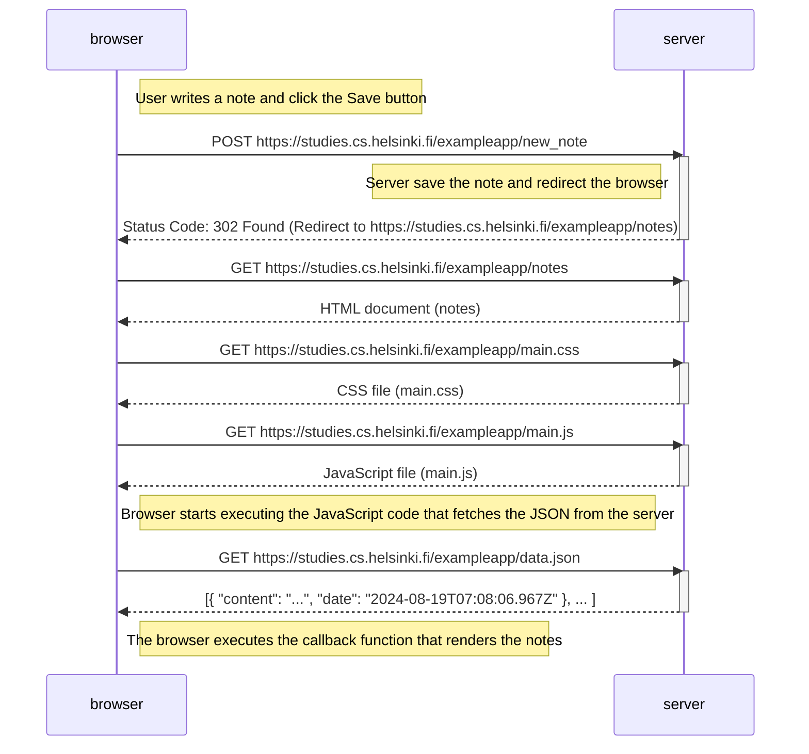

```mermaid
sequenceDiagram
    participant browser
    participant server

    Note right of browser: User writes a note and click the Save button
    browser->>server: POST https://studies.cs.helsinki.fi/exampleapp/new_note
    activate server

    Note left of server: Server save the note and redirect the browser 

    server-->>browser: Status Code: 302 Found (Redirect to https://studies.cs.helsinki.fi/exampleapp/notes)
    deactivate server

    browser->>server: GET https://studies.cs.helsinki.fi/exampleapp/notes
    activate server
    server-->>browser: HTML document (notes)
    deactivate server
    
    browser->>server: GET https://studies.cs.helsinki.fi/exampleapp/main.css
    activate server
    server-->>browser: CSS file (main.css)
    deactivate server
    
    browser->>server: GET https://studies.cs.helsinki.fi/exampleapp/main.js
    activate server
    server-->>browser: JavaScript file (main.js)
    deactivate server
    
    Note right of browser: Browser starts executing the JavaScript code that fetches the JSON from the server
    
    browser->>server: GET https://studies.cs.helsinki.fi/exampleapp/data.json
    activate server
    server-->>browser: [{ "content": "...", "date": "2024-08-19T07:08:06.967Z" }, ... ]
    deactivate server
    
    Note right of browser: The browser executes the callback function that renders the notes
    
```