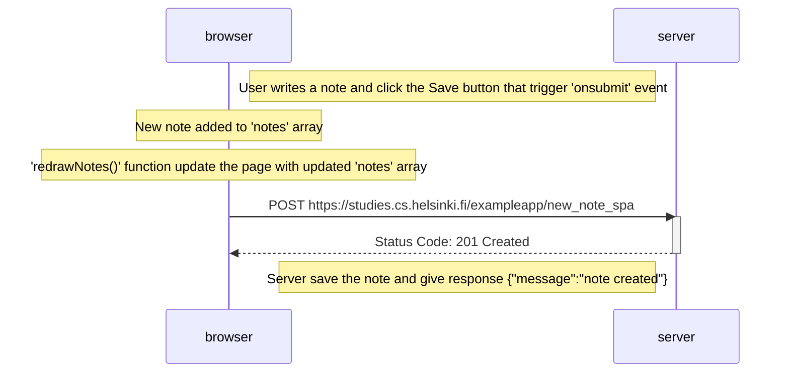

```mermaid
sequenceDiagram
    participant browser
    participant server

    Note right of browser: User writes a note and click the Save button that trigger 'onsubmit' event
    Note over browser: New note added to 'notes' array
    Note over browser: 'redrawNotes()' function update the page with updated 'notes' array
    
    browser->>server: POST https://studies.cs.helsinki.fi/exampleapp/new_note_spa
    activate server
    server-->>browser: Status Code: 201 Created
    deactivate server

    Note left of server: Server save the note and give response {"message":"note created"}
```